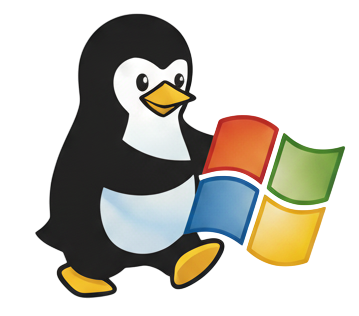

<h1 align="center">WinuX</h1>

  

  <strong>Windows 11 Linuxified</strong> 
  A comprehensive PowerShell-based dotfiles system that transforms Windows 11 into a highly automated, developer-friendly environment.

---

<h2 align="center">Key Features</h2>

|                              |                                                                                                                  |
| ---------------------------- | ---------------------------------------------------------------------------------------------------------------- |
| **One-Command Bootstrap**    | Go from a fresh Windows installation to a fully configured personalized dev environment in one command           |
| **Configurable**             | Everything can be configured to work based on personal preference                                                |
| **Multi-Machine Support**    | Manage multiple machines from one config                                                                         |
| **Package Management**       | Install predefined software with WinGet, Scoop and/or Chocolatey                                                 |
| **Dotfiles Management**      | Symlink all configurations and have the system behave and look exactly like you want                             |
| **Repository Orchestration** | Clone and update repositories with one command                                                                   |
| **Workflow Automation**      | Deterministically open and position entire workspaces on multiple monitors and virtual desktops with one command |
| **System Theming**           | One command multi-monitor theme and wallpaper setup                                                              |

### Getting Started

Everything you need to get WinuX running on your machine.

- [Prerequisites](getting-started/prerequisites.md)
- [Installation](getting-started/installation.md)
- [First Run](getting-started/first-run.md)

### Configuration

Deep dive into the configuration system.

- [Overview](configuration/overview.md) - How Configuration.psd1 works
- [Placeholder System](configuration/placeholder-system.md) - `{Dev}`, `{User}`, etc.
- [How-To Guides](configuration/guides/add-new-project.md) - Step-by-step tutorials

### Modules

Detailed documentation for every module and function.

- [Application](modules/application.md) - App launchers & installers
- [Bootstrap](modules/bootstrap.md) - System initialization
- [Configuration](modules/configuration.md) - Programmatic config modifications
- [Git](modules/git.md) - Repository management
- [Helper](modules/helper.md) - Utility functions
- [Logging](modules/logging.md) - Unified terminal & file logging
- [System](modules/system.md) - System configuration
- [Window](modules/window.md) - Window layout management
- [Workflow](modules/workflow.md) - Workspace automation

### AI Integration

Built-in AI context system for GitHub Copilot and similar assistants.

- [Overview](ai/overview.md) - How the layered context system works, slash commands, token optimization

### Reference

Quick reference materials.

- [Troubleshooting](reference/troubleshooting.md) - Common issues
- [Known Issues](reference/known-issues.md) - Known problems and workarounds

### Project

Where WinuX is headed and how it's governed.

- [Roadmap](roadmap.md) - Where WinuX is and where it's going
- [Contributing Guide](https://github.com/IvanPavlak/WinuX/blob/master/CONTRIBUTING.md)
- [Code of Conduct](https://github.com/IvanPavlak/WinuX/blob/master/CODE_OF_CONDUCT.md)
- [Security Policy](https://github.com/IvanPavlak/WinuX/blob/master/SECURITY.md)
- [MIT License](https://github.com/IvanPavlak/WinuX/blob/master/LICENSE)

---

## Contributing

Found a bug or want to contribute? Check out the [GitHub repository](https://github.com/IvanPavlak/WinuX).

---

## Acknowledgements

This was made possible by these awesome projects:

- [Microsoft-Activation-Scripts](https://github.com/massgravel/Microsoft-Activation-Scripts)
- [windows-11-setup](https://github.com/alec-hs/windows-11-setup) by alec-hs
- [Win11Debloat](https://github.com/Raphire/Win11Debloat) by Raphire
- [Windows 11 pin software to taskbar](https://github.com/letsdoautomation/powershell/tree/main/Windows%2011%20pin%20software%20to%20taskbar) by letsdoautomation

---

  Made with ❤️ by Ivan Pavlak &nbsp;·&nbsp; <a href="https://ko-fi.com/ivanpavlak">Support on Ko-fi</a>

